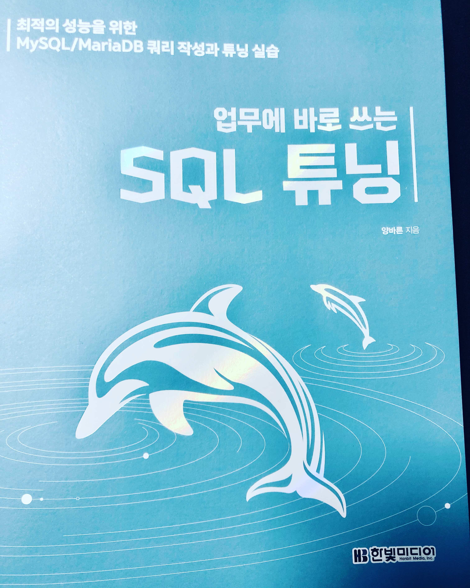

많은 DB 엔진들이 존재하고, 본인도 MySQL, MariaDB, PostgreSQL 등 다양하고 사용하고 있습니다.

사실 ORM을 사용하다보니, 직접적인 SQL문을 작성할 일은 거의 없습니다. 
하지만 ORM을 사용한다 해도, 기본적으로 사용하는 DB는 MySQL인 경우도 많고(점유율도 가장 높기도 하고..), 현재 본인이 진행하고 있는 프로젝트도 MySQL로 구성할 예정이고, 그러다보니 MySQL의 구성 및 동작원리를 알고 있는 것이 큰 도움이 될 것이라고 판단했습니다.

이 책은 막 입사한 DB 개발자도 읽을 수 있다고 되어 있는데, 정말 친절히 하나하나 설명이 되어 있습니다. 실습 또한 무리 없이 진행될 수 있도록 실습 DB 데이터도 준비되어 있어서 차근차근 따라가기 위한 배려가 충분히 되어 있습니다.

---

본 서적의 구성은 5개의  파트로 나뉩니다.

### MySQL과 MariaDB 개요

이 부분은 그냥 편하게 읽고 넘어가면 됩니다. SQL을 다루는 사람으로써의 기본 상식정도?

### SQL 튜닝 용어를 직관적으로 이해하기

이 부분부터 이 책의 진짜 시작이라고 할 수 있습니다.

이 챕터의 MySQL의 구성들을 읽으면서, 그동안 MySQL에서 만난 에러들을 해결하려고 찾았던 답변들의 설명들이 나와서 반갑기도 하고, 설명도 잘되어 있다고 생각했습니다.

MySQL의 구성들과 동작원리, 용어들을 학습하여, 앞으로 진행될 실습의 기초 지식을 쌓을 수 있습니다.
(개인적으로 가장 도움이 되는 챕터였습니다.)

### SQL 튜닝의 실행 계획 파헤치기

SQL을 튜닝하기 위해 실행계획을 조회하고, 조회되어 나오는 데이터들의 설명을 하는 챕터입니다. MySQL의 공식문서를 읽는 기분으로, 이 부분은 익숙해질 때까지 여러번 읽게 될 것 같습니다.

> 저는 우분투 20.04 LTS에 MySQL을 설치하여 실습을 진행하였고, 책에서는 윈도우 환경에서 MySQL을 설치하여 진행하였기 때문에, 약간의 설정 차이가 존재할 수 있습니다. 몇 가지 셋팅을 변경해 주어야 해결이 되는데, 이 부분에서 안된다고 삽질(저처럼..)하지 말고 바로 구글링해서 해결하세요.

### 악성 SQL 튜닝으로 초보자 탈출하기

비교적 간단한 악성 SQL 문을 튜닝하는 과정을 보여줍니다.

> 테이블에 여러번 접근하는 것이, 많은 데이터를 가져오는 것보다 리소스 소모가 적다..라는 걸 알게되었습니다.

### 악성 SQL 튜닝으로 전문가 되기

앞 챕터는 순한맛이였다면, 중간맛정도 되는 SQL 튜닝을 보여줍니다.

## Conclusion

개인적으로 ORM으로 쿼리문을 생성하고 있지만, MySQL의 기본적인 동작 원리를 이해하고 작성하는 쿼리문은 성능상에서도 차이가 나게 될 것입니다. 실무에 바로 도움이 될 수 있는 꿀팁과 DB를 만지는 개발자의 기초 체력을 더 탄탄히 해주는 책으로, 백엔드 개발자라면 꼭 읽어보는 것을 추천한다.

> 나중에 ORM과 SQL 튜닝에 대해서도 비교해가며 공부해보는 것도 좋을 듯합니다.

> 한빛미디어 "나는 리뷰어다" 활동을 위해서 책을 제공받아 작성된 서평입니다.
